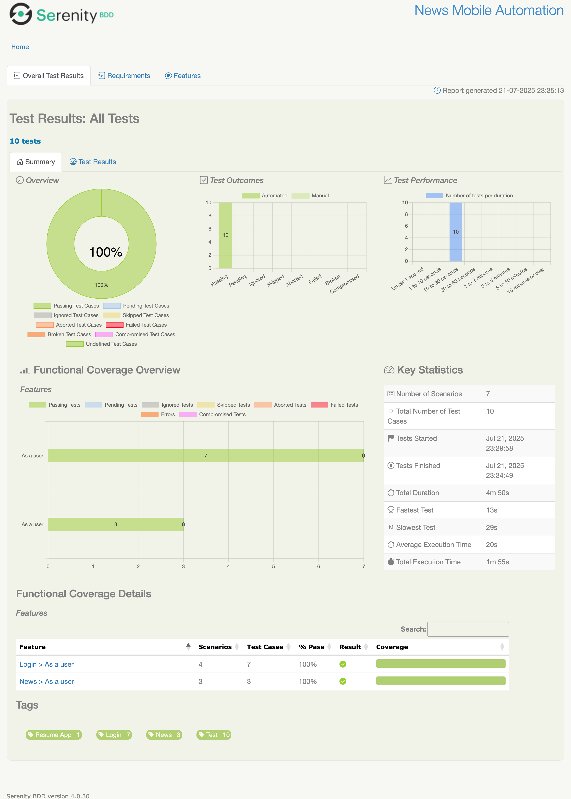

# SLIIDE Mobile App UI Automation Take-Home Task
The NEWS App Automation UI provides a serenity framework for automating tests to achieve the stated
objectives and key results.

## Objectives &amp; key results (OKRs)

Outlined is the objective of the NEWS APP test automation:

* To `detect defects early` and provide `quick feedback` to the development team.

* Improve overall release confidence of the development team and other key stakeholders.

## Architecture

This framework promotes `cross-collaboration` in the form of `three amigos`, leveraging the principles
of `behaviour-driven development` to write the test scenarios and development syntax.

The development of the test automation framework uses the outlined technologies and `Java 16` as its underlying
programming language.

## Technologies Used

*   **Java 16:** Programming language.
*   **Gradle 8.1.1:** Build automation tool.
*   **Serenity BDD (4.0.30):** BDD framework for reporting and managing test execution.
*   **Cucumber (7.11.1):** BDD tool for writing tests in Gherkin syntax.
*   **JUnit 5 (5.9.2):** Testing framework for running tests.
*   **SLF4j + Logback:** Logging framework.
*   **AssertJ:** Fluent assertions library (optional but included).

## Project Structure

The project follows a standard Maven/Gradle structure for Java projects:

```
project-root/
├── .gradle/                       # Gradle internal files (auto-generated)
├── build/                         # Compiled code and build artifacts (auto-generated)
├── gradle/
│   └── wrapper/
│       ├── gradle-wrapper.jar     # Gradle Wrapper executable JAR
│       └── gradle-wrapper.properties  # Gradle Wrapper configuration
├── src/
│   └── test/
│       ├── java/
│       │   └── com/
│       │       └── sliide/
│       │           └── qa/
│       │               ├── capabilities/   # Platform Based Driver Capabilities
│       │               ├── components/     # Driver Manager
│       │               ├── screens/        # Mobile page screen
│       │               ├── steplib/        # Reusable business actions
│       │               ├── steps/          # Step definition classes 
│       │               └── utils/          # Utility/helper classes 
│       └── resources/
            ├── app/                     # mobile apps (.apk or .app file)
│           └── features/                # Cucumber feature files
│           
├── serenity.properties               # Serenity BDD configuration
├── .gitignore                        # Git ignore file
├── build.gradle                      # Gradle build script
├── gradlew                           # Gradle wrapper script (Linux/macOS)
├── gradlew.bat                       # Gradle wrapper script (Windows)
└── README.md                         # Project readme/documentation
```

## Setup and Execution

### Prerequisites

1.  **JDK 11 or higher:** Ensure you have a compatible Java Development Kit installed. You can check your version with `java -version`.
2.  **Internet Connection:** Required for Gradle to download dependencies.

### Steps to Run Tests

1.  **Clone the Project:** Extract the contents of the project file to a location on your computer.
2.  **Open Terminal/Command Prompt:** Navigate into the root directory of the extracted project.
3.  **System Environment Variables:** Provide values for TEST_USERNAME and TEST_PASSWORD. 
4.  **Run Tests using Gradle Wrapper:**
    *   On Linux/macOS: Execute `./gradlew clean test` or
        `./gradlew clean clearReports autoLintGradle test aggregate reports -Dcucumber.filter.tags="@all and not @pending"`
    *   On Windows: Execute `gradlew.bat clean test`

    *Explanation:*
    *   `./gradlew` or `gradlew.bat`: Executes the Gradle wrapper, which automatically downloads and uses the correct Gradle version (8.1.1) specified for the project, ensuring build consistency.
    *   `clean`: Cleans the previous build outputs.
    *   `test`: Compiles the code and runs the tests defined in the `TestRunner` class, which in turn executes the Cucumber features.

5.  **View Reports:** After the tests finish execution, Gradle and Serenity BDD will generate reports.
    *   **Serenity Report:** The primary, detailed HTML report can be found at:
        `target/site/serenity/index.html`
        Open this file in your web browser to view comprehensive test results, including step details, execution times, and requirements coverage.
    *   **JUnit XML Report:** Located at `target/cucumber-reports/cucumber.xml`.
    *   **Basic Cucumber HTML Report:** Located at `target/cucumber-reports/cucumber-html-report.html`.

## Code Highlights

*   **Clean Code:** Efforts were made to follow clean code practices, including meaningful naming, clear method structures.
*   **BDD with Cucumber:** Scenarios are written in Gherkin syntax in `.feature` files, promoting collaboration and clear understanding of test goals.
*   **Step Definitions:** The `ScenarioSteps.java` classes links the Gherkin steps to Java code that interacts.
*   **Edge Cases:** Specific scenarios are included to test invalid inputs and error conditions.
*   **Configuration:** All the required dependencies are set in `build.gradle` file.
*   **Properties:** Device, Appium, Webdriver, Serenity properties are set in `serenity.properties` file.
*   **Gradle Wrapper:** Ensures consistent builds across different environments by using the specified Gradle version.

## Report Highlight


&copy; 2025 Test Application 
